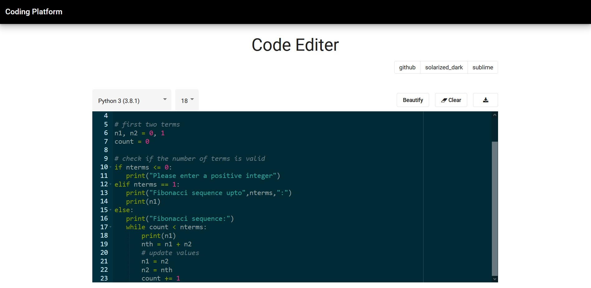
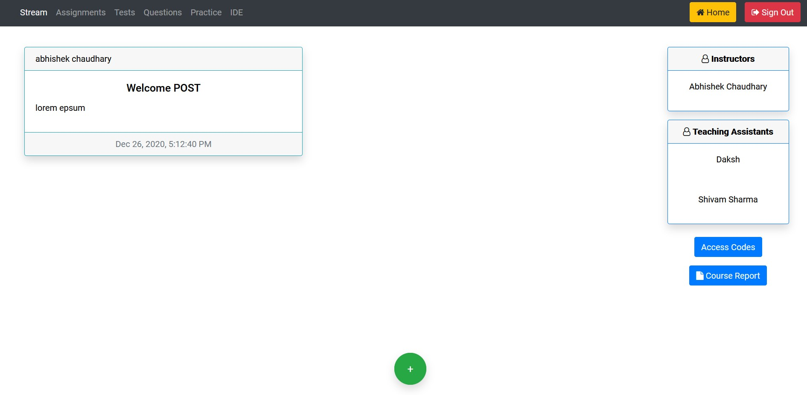

# Coding Platform[Contributed]

The  main  motive  of  this  project  at  first,  is  to  build  an  enhanced  coding  platform  that overcomes the limitations of the online available platform used to conduct labs by TAs in Introductory Programming and DSA courses. This project was started by [Sahil Bansal](https://www.linkedin.com/in/sahilbansal17/) and [Pratik Parmar](https://www.linkedin.com/in/pratik-parmar/) later I joined as a contributor. 

Following are the some fields i`ve contributed: 

- Added Email Verification
- Password Reset Option
- Parallelized runing for sub-testcases
- Rewamped the IDE
- Configured Judge0 to own VM instead of using free limit.
- Moved the project to Cloud

## Course Page



